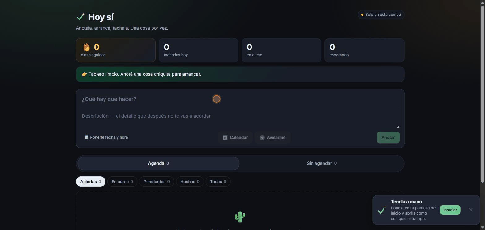

# Hoy sí

**Una lista de tareas para arrancar, no para administrar.**

El problema de una todo list común es que te muestra todo lo que no hiciste. Esta
hace lo contrario: te pide una sola cosa por vez, registra el momento en que
**empezaste** —no solo cuando terminaste— y al tachar te dice cuánto tardó de
verdad.

Casi siempre es mucho menos de lo que imaginabas. Esa es toda la idea.

🔗 **[tareas.ginialtech.com](https://tareas.ginialtech.com)**



*Anotar, empezar, tachar. Al final dice lo que tardó de verdad.*

---

## Las tres decisiones que la definen

No son funciones sueltas: son la respuesta a por qué cuesta empezar algo.

**1. Empezar ya es progreso.** Una tarea tiene tres estados, no dos. El botón
*Empecé* existe porque arrancar es el paso que más cuesta, y merece contar como
avance por sí solo.

**2. La antigüedad se ve.** Cada tarea abierta dice hace cuántos días espera. La
culpa vaga no mueve a nadie; un número concreto sí.

**3. Al final se muestra la evidencia.** Al tachar aparece cuánto llevó
realmente. Es la prueba, acumulada en tu propia lista, de que la tarea era más
chica que el peso que tenía encima.

De ahí salen dos reglas de interfaz que se respetan en todo el código:

- **El rojo es solo para lo que de verdad se pasó de fecha.** Una lista que te
  reta produce más evitación, que es exactamente lo que la app viene a combatir.
- **Ninguna acción puede terminar sin respuesta en pantalla.** Si algo no se
  guardó, se dice.

## Cómo se usa

La lista está partida en dos, porque son dos momentos distintos:

- **Sin agendar** — el volcadero. Todo lo pendiente, sin pensar en cuándo.
- **Agenda** — lo que tiene día, en bloques (*En curso*, *Se pasaron*, *Hoy*,
  *Mañana*, los días siguientes, *Terminadas*).

Se pasa de una a la otra con el botón 📅 de cada tarjeta. Las tareas con hora
pueden avisarte por **Telegram** o por **notificación del teléfono**, y también
generar un evento de **Google Calendar**.

## Levantarla

```bash
bun install
bun run dev
```

Abre en <http://localhost:5173>.

**Funciona sin configurar nada.** Sin credenciales de Firebase guarda en el
navegador y te lo avisa en pantalla. Para usar la nube, copiá `.env.example` a
`.env` y completá los valores de tu propio proyecto de Firebase.

> Requiere [bun](https://bun.sh). El proyecto no usa npm.

## Comandos

| Comando | Qué hace |
|---|---|
| `bun run dev` | Servidor de desarrollo |
| `bun run check` | Chequeo de tipos — **ver la advertencia de abajo** |
| `bun run build` | Chequeo + build de producción en `dist/` |
| `bun run preview` | Servir el build ya compilado |
| `bun run lint` | oxlint |
| `bun run rules` | Desplegar `firestore.rules` |

> ⚠️ **`tsc --noEmit` no sirve en este proyecto.** `tsconfig.json` usa
> `"files": []` con referencias, así que ese comando no compila nada y **termina
> con éxito aunque el código esté roto** (verificado rompiéndolo a propósito).
> El que chequea de verdad es `bun run check` (`tsc -b`), que además corre
> dentro de `bun run build`.

## Cómo está armado

**React 19 + Vite + TypeScript**, sin framework de servidor: no hay rutas ni SEO
que justifiquen algo más pesado. Los estilos son CSS plano con custom
properties, escrito **mobile first** — la app se usa parada, con el teléfono en
la mano, que es justo cuando se anota lo que se viene pateando.

Cuatro decisiones que vale la pena mirar si venís a leer el código:

**Almacenamiento enchufable.** `src/lib/store.ts` define una interfaz y elige el
backend al arrancar: Firestore si hay credenciales, `localStorage` si no —o si
la nube falla en caliente. Un problema de infraestructura nunca deja la app
inutilizable, porque no poder anotar algo es la mejor excusa para no hacerlo.

**Todo lo que entra se valida con zod.** Si un documento viene roto, se descarta
esa tarea sola en lugar de tumbar la aplicación entera.

**La seguridad se evalúa en el servidor.** `firestore.rules` no corre en el
navegador: se despliega a Google y se aplica en cada operación. Cada usuario
entra solo a su carpeta, y se valida la forma de cada documento. Reescribir el
JavaScript del cliente no sirve de nada.

**Ninguna clave privada toca el navegador.** Las variables `VITE_*` son públicas
por diseño y viajan en el bundle; los secretos de verdad no llevan prefijo y
viven solo del lado del servidor.

### Las piezas de servidor

| Pieza | Qué hace |
|---|---|
| `api/avisar.ts` | Busca tareas por vencer y manda los avisos. Protegida con `CRON_SECRET`. |
| `api/telegram.ts` | Webhook del bot: vincula la cuenta y atiende los botones del mensaje. |
| `api/log.ts` | Recibe los logs del navegador y los escribe con pino. |
| `worker/` | Un Cloudflare Worker de diez líneas que le toca el timbre a `api/avisar` cada minuto. Está ahí porque el cron gratuito de Vercel corre una vez por día. |

> En `api/` los imports relativos **llevan `.js`** aunque el archivo sea `.ts`:
> es ESM y Node no resuelve sin extensión. Sin eso la función ni arranca.

### Estructura

```
src/
  App.tsx            login + tablero: layout, filtros, orden, festejo
  types/task.ts      esquemas zod y tipos
  hooks/             sesión, tareas, configuración, notificaciones
  lib/               storage, agenda, fechas, mensajes, logger
  components/        formulario, tarjeta, detalle, avisos, menú
api/                 funciones de servidor
worker/              el despertador programado
firestore.rules      permisos y validación (se evalúan en Google)
```

## Documentación

| Archivo | Qué tiene |
|---|---|
| [`AGENTS.md`](./AGENTS.md) | El porqué de cada decisión tomada, con los errores que costaron tiempo |
| [`CLAUDE.md`](./CLAUDE.md) | Cómo se trabaja en este repositorio |
| [`docs/pendientes.md`](./docs/pendientes.md) | Lo que falta hacer |

## Licencia

[MIT](./LICENSE) — usala, copiala, cambiala.
